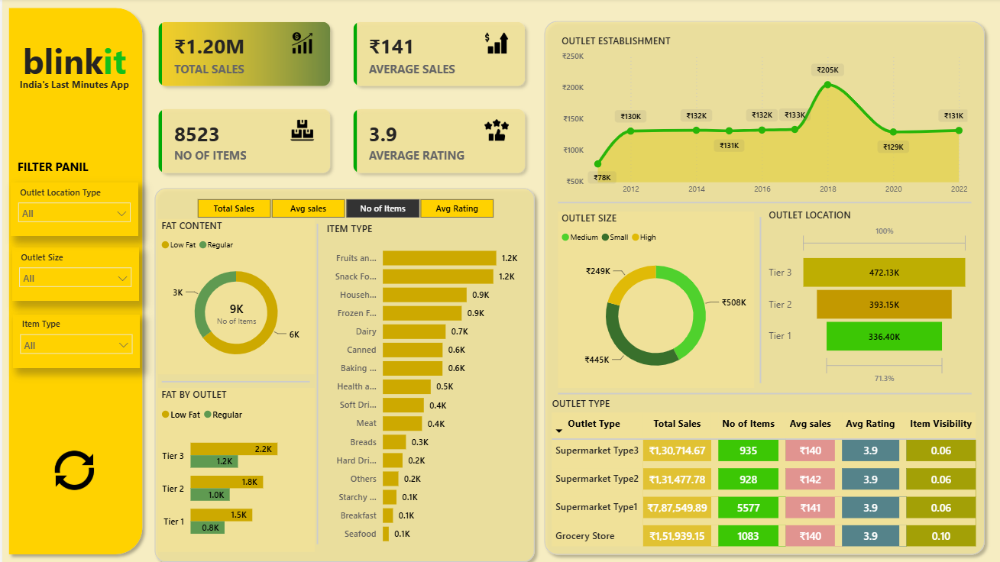

## 🛒 Blinkit Grocery Sales & Outlet Performance Analysis

> An interactive **Power BI dashboard** for analyzing Blinkit grocery sales, product performance, outlet characteristics, customer ratings, and sales trends.

An end-to-end Power BI business intelligence project analyzing Blinkit's grocery sales, product mix, outlet characteristics, customer ratings, and location performance.

---

##  📌  Project Overview

The objective of this project is to convert grocery retail data into a management-friendly Power BI dashboard.

The analysis focuses on:

- Overall sales performance
- Product and item-type performance
- Fat-content mix
- Outlet type and outlet size
- Outlet location/tier
- Outlet establishment trends
- Customer ratings
- Item visibility
- Interactive filtering

---

## 🎯 Business Problem

A grocery business needs to understand where revenue is coming from, which product categories contribute most to sales, and how outlet characteristics affect performance.

This dashboard provides a single analytical view for comparing product, outlet, location, and customer-related metrics.

---

# 🖼️ Dashboard Preview

Add your dashboard screenshot here:

```markdown

```

Recommended screenshot:

```text
screenshots/
└── dashboard.png
```
---

## 📋 Dataset

The PBIX uses the commonly used BlinkIT Grocery Data structure with 8,523 item-level records.

Important fields include:

- Item Identifier
- Item Weight
- Item Fat Content
- Item Visibility
- Item Type
- Outlet Identifier
- Outlet Establishment Year
- Outlet Size
- Outlet Location Type
- Outlet Type
- Sales
- Rating

> Note: The uploaded PBIX is included in `PowerBI/`. The underlying source table is embedded in the PBIX and is not redistributed separately in this package.

---

# 🛠️ Tools & Technologies

- **Microsoft Power BI**
- **Power Query**
- **DAX**
- **Data Visualization**
- **Excel / Tabular Data**
- **GitHub**

---

# 🔄 Data Analysis Workflow

```text
Raw Grocery Data
       ↓
Data Cleaning
       ↓
Data Transformation
       ↓
Data Modeling
       ↓
DAX Measures
       ↓
KPI Development
       ↓
Data Visualization
       ↓
Business Insights
```

---

## Dashboard KPIs

| KPI             | Value  |
|-----------------|--------|
| Total Sales     | ₹1.20M |
| Average Sales   | ₹141   |
| Number of Items | 8,523  |
| Average Rating  | 3.97   |

The KPI values above correspond to the standard BlinkIT Grocery Data version represented by this dashboard.

---

## 📊 Dashboard Analysis

### 1. Fat Content

Compares item volume across Low Fat and Regular products.

### 2. Fat Content by Outlet

Shows how product fat-content mix varies across outlet location tiers.

### 3. Item Type

Compares item volume across grocery product categories.

### 4. Outlet Establishment

Tracks total sales by outlet establishment year.

### 5. Outlet Size

Compares total sales across outlet size segments.

### 6. Outlet Location

Compares sales across Tier 1, Tier 2 and Tier 3 locations.

### 7. Outlet Type

Provides a consolidated comparison of:

- Total Sales
- Average Sales
- Number of Items
- Average Rating
- Item Visibility

---

## 💡 Key Business Insights

1. Supermarket Type1 is the largest contributor to total sales, with approximately ₹787.55K, or about 65.5% of total sales.
2. Tier 3 locations contribute approximately ₹472.13K, around 39.3% of total sales.
3. Regular-fat products account for roughly 64.6% of total sales in the standard dataset.
4. Medium-sized outlets contribute approximately ₹507.9K, making them the largest outlet-size segment by sales.
5. The establishment-year trend shows a pronounced sales peak around 2018 before later years settle into a lower range.
6. Product categories differ substantially in item volume, indicating that assortment performance is not uniform across the catalogue.
7. Outlet type, location and size provide useful segmentation variables for explaining differences in sales performance.
8. Average rating provides a customer-experience KPI that can be reviewed alongside revenue and volume rather than in isolation.

---

## 📋 Business Questions

See `Documentation/Business_Questions.md`.

## KPI Definitions

See `Documentation/KPIs.md`.

## Detailed Insights

See `Documentation/Insights.md`.

## Dashboard 

See `Documentation/Dashboard.md`.

---

## 📁 Repository Structure

```text
Blinkit-Data-Analysis/
│
├── README.md
│
├── PowerBI/
│   └── Blinkit_Dashboard.pbix
│
├── Dataset/
│   └── BlinkIT Grocery Data.xlsx
│
├── Images/
│   ├── Avg Sales.png
|   ├── Background kpi.png
|   ├── Refresh.png
|   ├── Items.png
|   ├── Rating.png
|   └── Sales.png
│
├──Query/
|   └── Query Doc.docx
|
├── Documentation/
|    ├── Business_Questions.md
|   ├── KPIs.md
|   ├── Insights.md
|   └── Dashboard.md
|
├──Screenshorts/
    └── dashboard.png
```
---

## 📚 Skills Demonstrated

### Data Analysis

- Data cleaning
- Data transformation
- Exploratory data analysis
- KPI analysis
- Category analysis
- Trend analysis
- Comparative analysis

### Power BI

- Power Query
- DAX measures
- KPI cards
- Interactive filters
- Charts and tables
- Dashboard design
- Data modeling

### Business Intelligence

- Business-question formulation
- Performance analysis
- Product analysis
- Outlet analysis
- Insight generation

---

# 🚀 How to Use

1. Download the `.pbix` file from the `powerbi` folder.
2. Open it using **Microsoft Power BI Desktop**.
3. If Power BI requests the source dataset, update the data-source path.
4. Refresh the data.
5. Use the filters and visuals to explore the dashboard.

---

# 👨‍💻 Author

**Sourabh Mondal**

Data Analysis | Power BI | SQL | Excel

- GitHub: https://github.com/sourabhmondal9?tab=repositories
- LinkedIn: www.linkedin.com/in/sourabhmondal14081999

---

# ⚠️ Disclaimer

This project is created for **educational and portfolio purposes**.

If the dataset is obtained from a public source, the original source and attribution should be added to this repository. Do not publish confidential, private, or personally identifiable information.

---

## ⭐ Project Focus

**Data → Analysis → Visualization → Business Insights**
